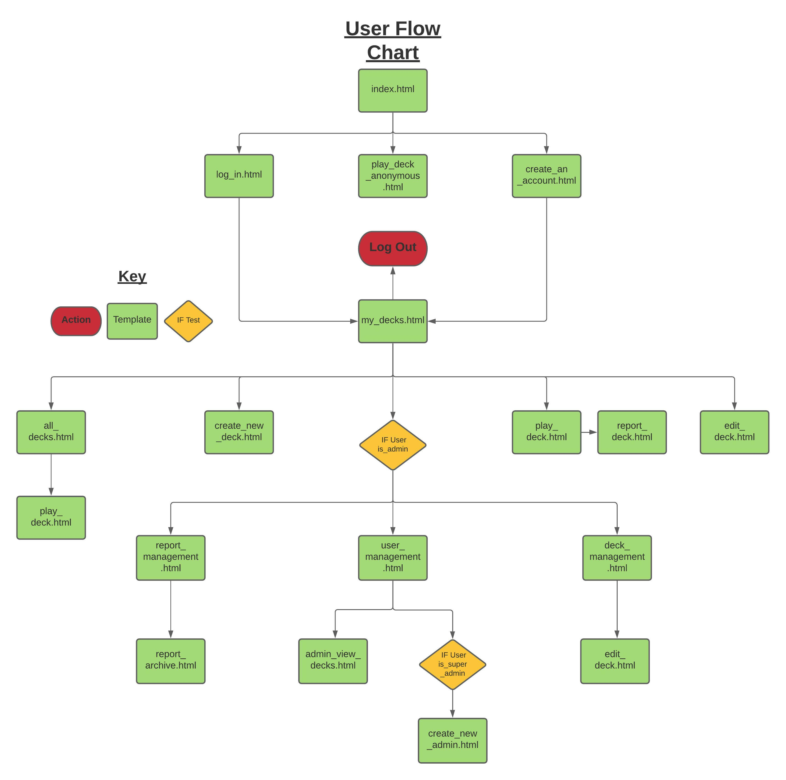

# **Flashcards - Code Institute Milestone 3 Project**
# **Introduction**

## **Milestone Project 3** by Denis Hayes
---
* This project has been developed to fulfil the requirements of the Code Institute's Milestone Project 3.
* This website's primary goal is to allow users to create and share decks of vocabulary Flashcards which will assist in learning European languages.
* In order to facilitate this goal, the site is connected to a database and utilises CRUD operations. 

---
## Live Website Access
---
Access the live website at: https://milestone-project-3-dh.herokuapp.com

---
 ## **The Five Planes of UX Design**
 ---
 * This Readme is divided into different sections, with each section referring to one of the Five Planes of UX Design. 
 * Some of the topics within each of the 5 sections unavoidably cross over into other planes. 
 * Where a topic escapes the remit of the Five Planes, it will be included at the end of the document in the section called 'Appedix'.

---
 ## **Table of Contents**
---

# **Strategy** 
 ## **The Aims of the Project**
 ---
* The primary aim of the project is to provide a set of tools which allow users to easily create and share custom decks of Flashcards, thereby making the learning of new vocabulary a more pleasant experience.
* The secondary aim of the site is to allow Administrators to easily manage the users of the site and their content. Content management is conducted within the site using a custom interface. 
---
## **User Stories**
---
### **First Time User**
* As a first time user I wish to be informed of the purpose of the website. This is achieved with a simple introductory message displayed to a user on the index.html page.
* The first time user is invited to click 'Play' on one of the decks on the page, or alternatively to 'Create an Account' if they wish to create their own decks. 
* On clicking 'Play' on one of the decks displayed to the user, they are taken to play_deck_anonymous.html, a play screen specifically designed for a user who isn't logged in. From here they are able to play with a deck and gain an understanding of how the deck system works. 
* For users who may already be familiar with how the site operates, the 'Create an Account' call to action will allow them to quickly and easily register their account.
* To create an account a new user must provide a username and a password.
* Should the user provide a username that already exists, they will be notified via a flash message at the top of the screen. 
* The flash message has been animated so as to be eye catching, and to make it clear to the user that the information being 'flashed' is new. 

### **Returning User**
* As a user who has already created an account I wish to be able to easily access the site's content.
* I wish to be able to access my own decks and any other decks that are important to me. This is achieved via my_decks.html, where the user can see their own decks and any decks they have 'loved' using the Love Deck system.
* Creating new decks should be a straightforward process. To create a new deck a logged in user should simply click the 'Create New Deck' button, found on my_decks.html. Clicking this button brings them to a new page, create_a_deck.html, which houses a form. This form asks the user to provide the important details of the deck, and then to provide the individual translations that will make up each side of the flashcard. The user may access detailed information about the deck building process by clicking on the information icon present on the form. 
* Editing an existing deck should be simalarly straightforward, and where possible should mimic the process of creating a deck. To edit a deck, a logged in user must simply click the 'Edit' button on any of their own decks as displayed on my_decks.html. Clicking this button brings the user to 'edit_deck.html' where they will be presented with a form that contains the same fields as those filled in when first creating the deck. These fields will be pre-populated with information already stored about the deck, the user needing only to update the fields that they wish to edit.
* Deleting a deck is also a simple operation for the user, although the process has been designed to reduce accidental deletions. To delete a deck a logged in user naviagtes to my_decks.html and then clicks the 'Edit Deck' button on the deck the wish to delete. From within edit_deck.html the user then needs to click the 'Delete this Deck' button, displayed prominently at the top of the page. Clicking this button opens a modal which asks the user to confirm their decision to delete the deck, thereby reducing accidental deletions. 
* In the event that I discover a deck that is unsatisfactory or offensive, I wish to have a means of making this known to Administrators. The flag icon attached to each deck allows a user to report a Deck which doesn't meet the standards of the site. Clicking on this icon brings the user to create_a_report.html, where they can fill out a form which details the basis of their report. Reports can then be viewed by any Administrative user.

### **Administrative User**
* As an Administrator it is important to me that I have the all the functionalities available to standard users while also having access to the tools required to properly manaage the website.
* There are 3 main types of content within the site that need to be managed by an Administrator: Users, Decks and Reports. To this end, Administrative users have access to a dropdown menu in the navbar called Admin Utilities. This menu provides navigation to three separate utilities: User Management, Deck Management and Reports. 
* The User Management screen provides the Administrator with a list of all site Administrators and Standard Users. From here, the Administrator can delete a problem user, or view any user's decks. Additionally, if the Administrator is a 'Super_Admin', they gain the ability to promote Standard Users to Administrators or to demote existing Administrators to Standard Users.
* The Deck Management screen provides the Administrator with a list of all of the Decks on the site. From here the Admin can see the most important details of each Deck and if necessary, Edit or Delete a deck using the respective buttons on the screen.
* The Reports screen provides the Administrator with a list of all currently open Reports. The reports are presented using a collapsible element. The initially visible section of the Report provides the Administrator with an overview of the Report, with further details being accessible on clicking the individual Report. It is for the Administrator to decide whether a report should be considered open or closed. The Administrator has the necessary tools to Edit or Delete the Deck to the point where it can be considered 'fixed', or in serious cases, they can delete the user who created the deck. Upon taking the necessary actions, an Administrator may wish to indicate that this particular report's misgivings have been handled, and can click the 'Close Report' button which will remove the report from 'Open Reports' section and move it to the Report Archives.
* In the event that a mistake has been made, or for some reason an archived report needs to be reopened, an Administrator can visit the Report Archives and click the Reopen Report button.

### **Site Owner**
* As the site owner it is important that I maintain control over the site, and have the ability to remove users who would impede this. This is achieved by the super_admin system, allowing the super_admin to demote other administrators and preventing other administrators from deleting the super_admin.
* As the site owner it is important that I can easily delegate the responsibilities of running the site to other users. This is achieved using the Administrator system.
* In the long run, and if the site is successful in attracting a large audience, I may wish to add some method of monetisation to the site. While currently outside the scope of this project, monetisation opportunities are present. Paying users could have the cap on their deck limit raised, or could be allowed to access exclusive official decks.
---
# **Scope** 
 ## **Existing Features**
 The following section details the existing features of the site, in their current implementation.
 ---
 ---
 ## **Existing Feature - Base**
 * The following features are present on all pages of the site, as every page extends from base.html.
 ---
### **Favicon**
* The Favicon is a small image of a set of cards, fanned out to convey the image of a deck. The favicon is distinct enough that it should stand out to users when they have multiple tabs open.
### **Header**
* The Header is present at all times when accessing the website, even when the user scrolls to the bottom of a page.
* The Header displays the brand name, Flashcards, prominently at all times. The brand name functions as a secondary 'Home' navigation link.
* The Header displays a dynamic navigation menu, which serves as a user's primary method of moving to different pages within the site. These items change depending on whether the user is logged in and whether or not the user is an administrator. 
* The Header's navigation links are replaced with a 'burger menu' icon on small screens. Clicking on this icon opens a sidenav which contains the same link elements as would be found on a large screen, displayed vertically.
* The aforementioned 'burger menu' icon has been positioned on the right side of the Header, thereby remaining consistent with the standard layout of the website. Similarly, the sidenav opens from the right side of the screen.
### **Footer**
* The Footer, like the Header, is present at all times when accessing the website. Unlike the Header, the Footer is only visible when the user reaches the end of a page. Depending on a page's contents, the Footer may be immediately visible or may only be visible after scrolling.
* The Footer features a call to action, directing the user to get in touch using one of the available methods.
* The methods in question are displayed using two different icons with different functions.
* THe GitHub Icon is an external link which opens my GitHub profile page in a separate tab.
* The Email Icon is a mailto link which, when clicked, opens the user's default email client in a separate tab and automatically filles the 'To' field with a contact email address.
* The Footer contains a copyright message.
* The Footer features a 'Back to Top' button which uses the 'smooth-scrolling' css property to smoothly scroll the user back to the top of any page they may be on.
---
 ## **Existing Feature - Index**
* This is the landing page for any user that visits the site for the first time, or for a user who isn't logged in.
 ---
### **Heading/Call to Action**
* The Heading/Call to Action is the first thing that a new user sees upon visiting the website.
* The Heading aims to introduce the main aim of the site (facilitating the learning of new vocabulary) quickly and simply.
* The Call to Action, just below the heading, invites the user to dive straight in and get started by playing one of the decks in the Deck Display, or alternatively, to Create an Account.
* The Create an Account text functions as a link to create_an_account.html.
### **Deck Display - All Decks**
* The Deck Display presents the user with all of the decks accessible on the site, with the most important details of the decks clearly visible.
* Each Deck within the display is presented in the rough shape of a deck of cards.
* Each Deck has its language displayed using a small flag icon at its head, as well as having the language noted in text underneath the icon. 
* Each Deck title, as dictated by its creator, is displayed on the Deck face, as well as its creator defined level.
* The creator of a Deck is displayed at the bottom left of each Deck, thereby allowing users to quickly identify decks by authors that they like or dislike.
* Each Deck has a play button that allows the user to access the Play screen for that speicific Deck.
---
 ## **Existing Feature - Create an Account**
* This page allows a new user to create a new account.
 ---
 ### **Create Your Account - Form**
 * The Create Your Account form asks the user to fill out two fields: Username and Password.
 * The form features standard Materialize validation.
 * On completion of the form, the user can click the Create Account button, and a new user will be added to the database. The user will then be redirected to their My Decks profile page.
 * If the user enters a Username that already exists, they will be notified of this with a flash message and the form will not submit. The user can try to create a new account immediately thereafter.
 * There is a call to action just below the form which asks if a user already has an account. If the user clicks on the highlighted text they will be redirected to the Log In screen.
 ### **Call to Action**
 * There is a call to action just below the form which asks if a user already has an account. If the user clicks on the highlighted text they will be redirected to the log in screen.
 ---
 ## **Existing Feature - Log In**
* This page allows an existing user to log into their account.
 ---
### **Log In - Form**
  * The Log In form requires two fields: Username and Password.
  * If the user inputs an existing username and the corresponding password, they will be logged in, granted a 'user' session cookie and redirected to their My Decks profile page.
  * If the user inputs a non-existent username or an incorrect password, they will be notified of their mistake with a flash message. This notification does not specify whether it is the username or the password that is incorrect, thereby increasing the security of the login.
### **Call to Action**
 * There is a call to action just below the form which asks if a user has not yet created their account. If the user clicks on the highlighted text they will be redirected to the Create an Account screen.
---
 ---
 ## **Existing Feature - Log Out**
* This features exists in the navbar of any user that is logged in.
* Clicking the 'Log Out' nav element will remove any session cookies that the user has and return them to the 'Log In' page.
 ---
## **Existing Feature - My Decks**
* This page serves as the user's profile page, displaying their personal content.
 ---
### **Username Banner**
 * The Username Banner displays the logged in user's username to them, indicating that this is their own personal page.
 ### **Your Decks - Deck Display**
* The Your Decks display presents all of the decks a user has created to them. 
* Each deck has two buttons: Edit and Play.
* The Edit button, only available to creators of a deck or an administrator, allows the user to change the contents of a deck. Clicking this button opens the edit_deck.html page for the specific deck.
* The Play button allows the user to play the deck. Clicking this button opens the play_deck.html page for the specific deck.
 ### **Create New Deck Button**
* Clicking the Create New Deck button redirects the user to create_deck.html.
 ### **Decks You Love - Deck Display**
* The Decks You Love display presents all of the decks a user has 'loved' using the Love system to the user. 
* From this display a user can quickly and easily play decks that they love, by clicking on the Play button on each deck.
---
## **Existing Feature - Love System**
* The Love System allows users to 'love' any deck of which they are **not** the creator.
* The system gives users a way to show appreciation for the work of others, and also allows the user to keep track of the decks that they really like.
* The logged in user can 'love' any deck that they did not create by clicking on the heart icon, as seen on the Play Deck screen.
* Clicking the heart icon appends the user's user_id to an array in the deck object called deck_loved_by and changes the appearance of the icon to indicate the action taken.
* Clicking the icon again will revert the icon to its original state and remove the user from the deck_loved_by array.
* When browsing decks on the All Decks page, the user can see which decks they 'love' and the decks that they do not yet 'love'.
 ---
## **Existing Feature - Create New Deck**
* This is the page that a user accesses when they want to create a wholly new deck.
---
 ### **Create New Deck - Deck Information Modal**
 * Clicking on the information icon in the Create New Deck Form will display a a modal to the user.
 * The modal provides the user with a detailed overview of the steps required to Create a Deck.
 * The modal also provides useful tips to ensure that a user is aware of the standard expected of them when they Create a Deck.
 ### **Create New Deck - Deck Overview - Form**
 * The Create New Deck form is used by users when they wish to create a brand new deck.
 * The user must fill in the four Deck Overview fields: Deck Name, Deck Language, Deck Level and Deck Description. All fields are validated and required. Attempts to submit the form without filling out all fields will fail.
 * The Deck Name field is a text input and is used to give the deck its title. This input has a min-length property of 5 and a max-length of 30.
 * The Deck Language field is a select element, with the options of: French, German, Italian and Spanish. This field indicates to users the language used within the deck. The language is represented within the select element with both text and a small flag icon.
 * The Deck Level field is a select element, with the options of: Beginner, Intermediate and Advanced. This field indicates to users which level of learner this deck has been designed for.
 * The Deck Description field is a text input and is used by the creator to add extra information and context to a deck. This input has a min-length property of 20 and a max-length of 100.

 ### **Create New Deck - Cards - Form**
* The Cards section of the Create New Deck form allows the user to add up to 30 cards to their deck.
* Each Card form element has two inputs: English and Translation.
* The user is expected to add the English version of the vocabulary in the 'English' input on the left, and the translated version of the word in the 'Translation' input on the right. These inputs each have the minlength property of 2 and the maxlength property of 32.
* A user can add a new card to the deck by clicking the 'Add New Card' button. Clicking this button generates a new card form element which can be filled out exactly like the pre-generated card element.
* The new card element can also be deleted before submission, thereby allowing the user to dynamnically add as many cards as they need, and remove those that they don't need. 
* The dynamic card creation and deletion is achieved using JavaScript contained in static/js/script.js.
 ---
## **Existing Feature - Edit Deck**
* The Edit Deck page allows a user to edit an existing deck.
---
 ### **Edit Deck - Deck Overview - Form**
* The Deck Overview section is identical to the form used when creating a new deck, except that the form values are pre-filled with the deck's existing values.
* The user can update any of these values within the original constraints as outlined in the Create New Deck section.
 ### **Edit Deck - Cards - Form**
 * The cards section is identical to the form used when creating a new deck except that the form values are pre-filled with the deck's existing values.
 * It is not possible to delete the cards that have already been committed to the deck on an individual basis.
* Adding a new card functions in the same way as outlined in the Create New Deck section.
 ### **Edit Deck - Delete All Cards - Button**
* When clicked, this button displays a modal to the user asking them if they are sure that they want to delete all cards in the deck.
* If the user clicks the follow-up delete button, all cards within the deck will be deleted.
 ### **Edit Deck - Delete This Deck - Button**
 * When clicked, this button displays a modal to the user asking them if they are sure that they want to delete this deck.
 * If the user clicks the follow-up delete button, this deck will be deleted. 
 ### **Edit Deck - Love Counter Display**
 * The Love Counter Display tells the user how many other people love their deck. This system rewards users for their work on a deck and acts as feedback to tell them when they're making good decks.
 ### **Edit Deck - Report Counter Display**
* The Report Counter Display tells the user how many reports have been submitted about this deck. This system can inform a user that their deck is unacceptable in some way, perhaps prompting them to change the deck.
 ---
## **Existing Feature - Play Deck**
* Two versions of the Play Deck screen exist: play_deck.html and play_deck_anonymous.html.
* The first version, play_deck.html is for logged in users and has additional features such as the ability to 'love' a deck and to submit a report about a deck. 
* The second version, play_deck_anonymous.html is for users who haven't logged in. This version does not include the option to 'love' a deck or to submit a report about a deck.
* The features described below are those of play_deck.html, as it is the most feature complete version of the page.
* The Play Deck page is what users see whenever they click the 'Play' button on any deck. The deck will be rendered to the user with the Deck Overview at the head of the page and with each card in the deck displayed beneath the overview.
---
 ### **Play Deck - Deck Display**
* The Deck Display gives the user an overview of the deck that they're playing. It contains all of the deck's basic information including its name, language, level, who it was created by and the deck description.
 ### **Play Deck - Love Deck**
* The heart icon within the deck display allows a logged in user to 'love' the deck that they're playing.
 ### **Play Deck - Report Deck**
* The flag icon within the deck display allows a logged in user to report the deck that they're playing.
 ### **Play Deck - Cards**
* Each card within the deck is represented with a 2 sided, flippable card.
* The first side of the card displays the English version of the vocabulary to the user as well as a question mark, indicating that the card has not yet revealed the vocabulary translation.
* The first side of the card also contains the 'Flip Card' button. When the user clicks on this button the card plays an animation and flips to show the second side of the card.
* The second side of the card displays both the English version of the vocabulary and its translation.
* The second side of the card does not display the 'Flip Card' button.
 ### **Play Deck - Reset Deck - Button**
* There are 2 reset deck buttons on each Play Deck page. These buttons appear at the top and bottom of the card display.
* When the user clicks one of the Reset Deck buttons, all cards are reset to their original state.(Displaying the first side).
 ---
## **Existing Feature - Report Deck**
* The Report Deck page allows a user to formally issue a complaint about a specific deck.
---
 ### **Report Deck - Deck Display**
 * The Report Deck Deck Display provides the user with an overview of the deck that they are reporting. This helps to ensure that the user does not accidentally report the wrong deck.
### **Report Deck - Information Display**
* The Infomation Display is shown on large screens and gives the user an overview of what happens when a user reports a deck.
 ### **Report Deck - Form**
* The Report Deck Form provides the user with a series of preset checkboxes which outline the reasons for their report.
* The Report Deck Form also allows the user to provide more details of their report in text form in the Report Details input. This input has a min-length property of 20 and a max-length property of 350. These parameters allow a user to give an extensive description of their reasons for reporting a deck.
---
## **Existing Feature - Admin Utility - User Management**
* The User Management page gives site administrators access to an overview of all site users and a set of actions to manage them.
---
### **User Management - Administrator Display**
* The Administrator Display shows the administrative user a tabular set of data of all of the administrators on the site.
* The data display includes the Administrators' names and their join dates, although the table could be further expanded upon to display any available data.
* The administrative user can also click the 'View Decks' button to get a list of all decks created by that administrator, presented through the Deck Management page.
* If the user accessing the User Management page is a super_admin they have access to a number of additional utilities:
  * A super_admin can Promote any existing Standard User to the position of Administrator by clicking the 'Promote' button beside their name.
  * A super_admin can Demote any existing Administrator to a Standard User by clicking the 'Demote' button beside their name.
  * A super_admin can Delete any existing Administrator completely, and in doing so delete all of their decks. They do this by clicking the 'Delete Admin' button, which opens a modal, and then confirming the deletion.
  * A super_admin can Create a New Admin by clicking the 'Create New Admin' button at the top of the Administrator Display.
  Clicking this button brings the super_admin to create_new_admin.html, where they must enter a Username and a Password to complete the administrator creation.
### **User Management - Standard Users Display**
* The Standard Users Display shows the administrative user a tabular set of data of all of the Standard Users on the site.
* The data display includes the Standarad Users' names and their join dates, although the table could be further expanded up to display any available data.
* The administrative user can also click the 'View Decks' button to get a list of all decks created by that user, presented through the Deck Management page.
* The administrative user can Delete any existing(non-administrative) user completely, and in doing so delete all of their decks. They do this by clicking the 'Delete User' button, which opens a modal, and then confirming the deletion.
---
## **Existing Feature - Admin Utility - Deck Management**
* The Deck Management page gives site administrators access to an overview of all decks on the site and a set of actions to manage them.
---
### **Deck Management - All Decks Display**
* The All Decks display presents the administrative user with a list of all decks hosted on the site, organised in the order of the name of their creator.
* The data display includes the names of the decks, their creators, and their basic information, although the table could be further expanded up to display any available data.
* The administrative user can click the 'Edit Deck' button to access the edit_deck.html page for any specific deck. This allows the administrator to make any changes necessary to ensure the high standard of the website's decks.
* The administrative user can delete a deck by clicking the 'Delete Deck' button. This opens a modal which asks for a confirmation of the deletion. Confirming the deletion permanently deletes the deck. 
---
## **Existing Feature - Admin Utility - Report Management**
* The Report Management page gives site administrators access to an overview of all of the reports submitted by users.
---
### **Report Management - Open Reports Display**
* The Open Reports display presents the administrative user with a list of all of the currently open reports on the website, organised in the order of their submission.
* The reports are presented in a collapsible format, with the heading of each collapsible element displaying identifying information about the report including the deck name, the username of the person who reported it and the date that the report was submitted.
* Clicking on any element of the collapsible opens it, presenting the full report to the administrative user.
* The full report contains the Report Reasons checkboxes, and the Report Details as filled out by the report creator.
* The Report Reasons checkboxes in each report are pre-filled with the boxes that the report creator checked, allowing the administrative user to quickly determine the primary reasons for the report.
* The Report Details section contains the Report Details as provided by the report creator. These details give the report creator the opportunity to fully explain their reasoning for their report. 
* The date that the report was created on is displayed underneath the Report Details section.
* The administrative user has access to 2 actions when viewing a report:
  * The administrator can click the 'Edit Deck' button within the report to directly access the edit_deck.html page for the deck. This function allows the administrator to quickly rectify any errors within the deck where  necessary.
  * The administrator can click the 'Close Report' button to mark this report and its contents as having been dealt with. This action does not delete the report, but sends it to the Report Archive.
### **Report Management - Archived Reports**
* The Report Archive maintains a record of all of the reports submitted by users, even after they have been closed by an administrator.
* The Report Archive is identical to the Open Reports Display in every way but one. Rather than having a 'Close Report' button, reports within the Report Archive have a 'Reopen Report' button. This button removes the report from the Report Archive back to the Open Reports section, thereby indicating that the report still needs to be reviewed.
---
 ## **Upcoming Features**
 The following section details some of the features planned for future implementation.
 ---
 ---
 ## **Upcoming Feature - Private Decks**
 ---
* Private Decks would allow users to toggle a setting when creating or editing a deck that would change whether or not other users of the website can see the deck.
* This feature would allow users to build private deck collections for their own use, and without having to adhere to the general standards of the website.
* Consideration must be taken of the incentive to publish a deck if Private Decks are allowed. Many users would likely create private collections and never publish a deck, thereby detracting from the knowledge sharing features of the site. To combat this, a limit could be placed on the number of Private Decks a user can have. This limit could be increased based on the number of public decks this deck author has.
---
 ## **Upcoming Feature - Admin Dashboard**
 ---
 * The Admin Dashboard would be a separate page, available only to administrators, that displays a selection of site data. 
 * The data displayed on the Admin Dashboard can be configured to whatever the administrators may need, including a display of the total number of users on the site, the total number of decks and the number of open reports. 
 * The Admin Dashboard would function as a first stop for an administrator upon login to the website, alerting them to any issues which need their attention.
---
 ## **Upcoming Feature - Auto-Translation**
 ---
 * Auto-Translation is a feature that would be used in the deck creation process.
 * Auto-Translation would be a toggleable switch that would contact the Google Translate API to translate the user's input on submission of their deck creation form, thereby eliminating the need for the user to manually translate the vocabulary in their deck.
 * One issue that would need to be overcome is that of mis-translations being used in cases where one word has multiple possible translations.
 ---
 ## **Upcoming Feature - User/Deck Management Sorting**
 ---
* Sorting of the User/Deck Management tables based on their different values would allow the administrator more control over the data that they are viewing, thereby improving their experience.
 ---
 ## **Upcoming Feature - Pagination**
 ---
* Pagination would limit the number of items (decks, users, reports etc.) displayed on a page. Once the page exceeds the chosen limit, further items would be displayed on a second 'page', navigable by a clickable menu.
* Pagination of the different deck and user displays would allow for more concise and readable displays as the site grows.
---
 ## **Upcoming Feature - Deck Play Counter**
 ---
 * The Deck Play Counter is a partially implemented feature, whereby every time a deck is played the deck_times_played field in the Decks collection would be incremented.
 * The deck_times_played field is currently instantiated every time a new deck is created, but playing a deck does not increment the counter.
 * The counter will be incremented every time any user plays a deck, allowing for the tracking of the popularity of a each deck based on how many times that deck is played. 
---
# **Structure** 
 ## **Data Structure**
 The following section details the implementation of data within this project.
 ---
 ---
 ## **Database - MongoDB - ms3_db**
 ---
 * MongoDB is the No-SQL database used in this project.
 * The database name is: ms3_db
 * The database Cloud Provider is Amazon Web Services, in the Ireland(eu-west-1) region.
 * The database uses Cluster Tier M0 Sandbox, with 512 MB of storage. This tier of cluster is **free**.
 * The database is not suitable for a production environment as a result of the storage limitation, as it is expectd that the website would exceed this limit.
 * The database contains the three main collections used to hold the website's data: Users, Decks, Reports.
  ---
 ## **Database - Data Schema**
 ---
 
  ---
 ## **Database - Collections - Users**
 ---
 * The Users collection houses the information of all users of the site, whether they are a Standard User or an Administrator. 
* A new user can be instantiated in two ways:
  * When an unregistered user correctly fills in the Create Account form and submits it.
  * When a super_admin correctly fills in teh Create New Admin form and Submits it.
* The Users collection holds the following data on each user:
  * _id: This is the MongoDB generated ObjectId for each object.
  * username: This is the user's username as entered in the Create Account/Create New Admin form.
  * password: This is the user's password as entered in the Create Account/Create New Admin form, after being processed by Werkzueg's password hash generator.
  * is_admin: This field denotes whether or not a user is an administrator of the site. If the user is an administrator they will have additional access when using the site. By default, a new user who creates an account will not be granted administrator priviliges. By default, if the super_admin creates a new admin, that user will be granted administrator priviliges.
  * is_super_admin: This field denotes whether or not a user is a super_admin of the site. If the user is a super_admin they will have full access to all site functionality, including the promotion/demotion of administrators, the creation of administrators and the deletion of adminstrators. A super_admin can only be created by accessing the MongoDB database directly and manually assigning True to the is_super_admin field.
  * join_date: This field logs the date that each specific user is created.
---
 ## **Database - Collections - Decks**
---
* The Decks collection houses the information of all decks on the site.
* A new deck can be instantiated by any user who correctly fills out the Create Deck form.
* The Decks collection holds the following data on each deck:
  * _id: This is the MongoDB generated ObjectId for each object.
  * deck_name: This is the name given to the deck by its creator.
  * deck_language: This is the deck's language, as stated by its creator. Currently, only four values can be added to this field using the select element in the form:
    * French
    * German
    * Italian
    * Spanish
  * deck_level: This is the deck's level, as stated by its creator. Currently, only three values can be added to this field using the select element in the form:
    * Beginner
    * Intermediate
    * Advanced
  * deck_description: This is a description of the deck, penned by the deck's creator. This should be a concise description of the deck, explaining the content of the deck to other users.
  * deck_created_by: This field contains the username of the deck's creator.
  * deck_created_by_id: This field contains the _id of the deck's creator.
  * deck_loved_by: This field is an array, containing the _ids of any user who has loved the deck using the Love System.
  * deck_love_counter: This field is a simple counter, incremented any time a user 'loves' a deck using the Love System and decremented any time a user 'unloves' a deck.
  * deck_times_played: This field is a simple counter, but has not yet been implemented. See 'Upcoming Feature - Deck Play Counter' for more information.
  * deck_card_fronts: This field is an array of all of the 'fronts' of the cards as determined by the deck's creator. This array is iterated through to produce the 'front' side of each card on the Play screen. The ordered nature of an array allows the 'fronts' of the cards to be matched to the corresponding 'backs'.
  * deck_card_backs: This field is an array of all of the 'backs' of the cards as determined by the deck's creator. This array is iterated through to produce the 'back' side of each card on the Play screen. The ordered nature of an array allows the 'backs' of the cards to be matched to the corresponding 'fronts'.
---
 ## **Database - Collections - Reports**
---
* The Reports collection houses the information of all reports on the site.
* A new report can be instantiated by any user who correctly fills out the Create Report form.
* The Reports collection holds the following data on each report:
  * _id: This is the MongoDB generated ObjectId for each object.
  * deck_name: This is the name of the deck that is being reported. The deck's name is automatically applied to the report when a user clicks on the Report Icon of a deck.
  * reported_by: This is the username of the user who has submitted the report.
  * report_date: This field logs the date that each specific report is created.
  * report_check_1: This boolean tracks whether or not the user checked the corresponding checkbox when submitting the report. This particular checkbox indicates that the deck has been reported for the following reason:
    * Cards are not in the correct language.
  * report_check_2: This boolean tracks whether or not the user checked the corresponding checkbox when submitting the report. This particular checkbox indicates that the deck has been reported for the following reason:
    * It contains improperly translated cards.
  * report_check_3: This boolean tracks whether or not the user checked the corresponding checkbox when submitting the report. This particular checkbox indicates that the deck has been reported for the following reason:
    * The content does not align with the level.
  * report_check_4: This boolean tracks whether or not the user checked the corresponding checkbox when submitting the report. This particular checkbox indicates that the deck has been reported for the following reason:
    * The deck name and content don't match.
  * report_check_5: This boolean tracks whether or not the user checked the corresponding checkbox when submitting the report. This particular checkbox indicates that the deck has been reported for the following reason:
    * It contains offensive language and/or themes.
  * report_check_6: This boolean tracks whether or not the user checked the corresponding checkbox when submitting the report. This particular checkbox indicates that the deck has been reported for the following reason:
    * For a reason not within this list.
  * report_details: This field is an expansion on the user's reasons for reporting the deck, to provide further context to the administrator reviewing the report.
  * report_closed: This boolean tracks whether or not the report is considered 'Closed' by the administrators. If a report is closed, it is removed from the Open Reports display and placed in the Report Archive. 
---
  # **Skeleton** 
 ## **Site Structure**
 The following section details the different views/pages of the website.
 ---
 * This uses Flask's templating system to render the different views of the website.
 * All templates extend from base.html.
 * Each section 
---
 ## **Site Structure - User Flow Chart**
---
 
---
 ## **Site Structure - Wireframes**
 * This section contains images of the wireframes created in the pre-production stages of this project.
 * All wireframes that have been created can be found in the README_ASSETS/Wireframes_Desktop and README_ASSETS/Wireframes_Mobile.
-Desktop.png)

---
 
---
 ## **Site Structure - Template: base.html - (Accessible by: All Users)**
---
* This is the base view, from which all other views on the site extend.
* This template contains the Header, Navbar and Footer.
* All site templates are injected into the content block of base.html.
---
 ## **Site Structure - Template: index.html - (Accessible by: Non-Logged In Users)**
---
* This template serves as the first point of contact for a first time user and any user who has yet to log in.
* This template contains a welcome message and the All Decks display.
---
 ## **Site Structure - Template: play_deck_anonymous.html - (Accessible by: Non-Logged In Users)**
---
* This template renders a play screen for users who haven't logged in, allowing them to access and flip the cards within a deck, but without allowing the user to access user-only features such as the Love and Report systems.
---
 ## **Site Structure - Template: login.html - (Accessible by: Non-Logged In Users)**
---
* This template is used to authenticate users and assign them their session cookies.
* Passing this checkpoint determines which features of the website are availabel to the user.
---
 ## **Site Structure - Template: login.html - (Accessible by: Non-Logged In Users)**
---
* This template is used to authenticate users and assign them their session cookies.
* Passing this checkpoint determines which features of the website are availabel to the user.
---
 ## **Site Structure - Template: create_an_account.html - (Accessible by: Non-Logged In Users)**
---
* This template allows a non-registered user to create a new account.
* Filling in this form correctly and submitting it both creates the user's account(instantiating a new 'user' object in the database) and then grants the user their session cookie.
---
 ## **Site Structure - Template: my_decks.html - (Accessible by: Super_Admins/Administrators/Users)**
---
* This template serves as each user's profile page and is unique to them.
* This page displays each user's decks and the decks that the user has loved using the Love system.
---
 ## **Site Structure - Template: play_deck.html - (Accessible by: Super_Admins/Administrators/Users)**
---
* This template renders a play screen for users who have logged in, allowing them to access and flip the cards within a deck while having access to the Love and Report systems.
---
 ## **Site Structure - Template: create_deck.html - (Accessible by: Super_Admins/Administrators/Users)**
---
* This template allows a user to fill out the Create Deck form, thereby instantiating a new 'deck' object in the database. 
---
 ## **Site Structure - Template: edit_deck.html - (Accessible by: Super_Admins/Administrators/Users)**
---
* This template allows a user to edit an existing deck that they have created.
* Administrative users are additionally able to access this template for decks that they are not the creators of, through the use of administrator utilities.
---
 ## **Site Structure - Template: create_report.html - (Accessible by: Super_Admins/Administrators/Users)**
---
* This template allows a user to fill out the Create Report form, thereby instantiating a new 'report' object in the database.
---
 ## **Site Structure - Template: 404_error.html - (Accessible by: All Users**
---
* This template is displayed to any user who tries to access a page that does not exist.
---
 ## **Site Structure - Template: 500_error.html - (Accessible by: All Users)**
---
* This template is displayed to any user who experiences a server error.
---
 ## **Site Structure - Template: user_management.html - (Accessible by: Super_Admins/Administrators)**
---
* This template allows administrative users to view and manage all of the users of the site.
---
 ## **Site Structure - Template: create_new_admin.html - (Accessible by: Super_Admins)**
---
* This template allows super_admin users to create new administrators.
---
 ## **Site Structure - Template: deck_management.html - (Accessible by: Super_Admins/Administrators)**
---
* This template allows administrative users to view and manage all of the decks on the site.
---
 ## **Site Structure - Template: report_management.html - (Accessible by: Super_Admins/Administrators)**
---
* This template allows administrative users to view and manage all open reports.
---
 ## **Site Structure - Template: report_archive.html - (Accessible by: Super_Admins/Administrators)**
---
* This template allows administrative users to view and reopen closed reports.
---
 ## **Site Structure - Template: admin_view_decks.html - (Accessible by: Super_Admins/Administrators)**
---
* This template allows administrative users to view all decks created by any specific user.
---
  # **Surface** 
 ## **Design Notes**
 The following section details some of the design decisions applied to this website.
---
---
 ## **Design Notes - Materialize Framework**
---
* The Materialize framework has been used extensively throughout the website.
* The grid system used to affect the layout of the site is the Materialize system.
* The Navbar, the Sidenav and the button that opens the Sidenav are Materialize elements.
* All buttons found throughout the site are Materialize elements.
* The card elements found throughout the site used to display representations of the decks and various forms are standard Materialize elements, customised for use within the site.
* The tables found in the User/Deck Management templates are derived from the Materialize table element.
* The collapsible found in the Report Management template is derived from the Materialize collapsible element.
---
 ## **Design Notes - Responsivity**
---
* The website has been designed to be fully responsive, meaning that it functions properly on any screen size.
* The primary responsivity tool used has been the Materialize grid system in conjuntion with the preset screen size settings (s, m, l etc.) provided with Materialize.
* Where necessary, CSS Media Queries have been used to create custom display rules outside of those present within the Materialize framework. These Media Queries have been created in line with the screen sizes present in the Materialize framework, thereby ensuring compatibility and predictable usage.
 
 
 
---
 ## **Design Notes - Animations**
---
* Certain elements within the website have been animated to improve user experience and to add visual flair where needed.
* Animista was used to generate the animation and keyframes for the flash messages used to display information to the user.
* A custom animation has been used to create the card-flipping effect as seen on the play screens. This animation was adapted from a YouTube tutorial, as found here: https://youtu.be/IrVLi0t8HRQ
---
 ## **Design Notes - Icons**
---
* Icons have been used throughout the website to improve user experience and to enhance the visual aspects of the site.
* All icons, with the excepetion of the custom flag icons, have been sourced from Font Awesome.
---
# **Appendix** 
 ## **Technologies Used**
 This section contains an overview of the different technologies used for the realisation of this project.
---
---
 ## **Technology - MongoDB/PyMongo**
---
* MongoDB has provided the database on which all of this website's data is stored.
* Using PyMongo, the database is referenced to render the data to the website.
---
 ## **Technology - Heroku**
---
* This website is hosted on Heroku.
* The Heroku host has been linked to a GitHub account, from which the site is built according to GitHub's version control.
---
 ## **Technology - GitHub**
---
* The version control of this website is handled by GitHub, which has been set up to automatically push new builds to Heroku, the host.
---
 ## **Technology - GitPod**
---
* GitPod, served through GitHub, was the IDE used during the development of this website.
 ## **Technology - Flask/Jinja2**
---
* The Flask framework has been used to allow for templating and other advanced rendering features. 
* Using Jinja2 through Flask has allowed for the injection of variable and conditional logic into the templates rendered.
---
 ## **Technology - Materialize 1.0.0**
---
* The Materialize framework has been used throughout this website, providing its grid system, responsivity controls and html elements such as the sidenav and collapsible.
---
 ## **Technology - JQuery 3.6.0**
---
* JQuery has been used to in place of vanilla JavaScript throughout this website.
* All elements involving JavaScript use JQuery syntax and all Materialize scripts have been imported in JQuery.
---
 ## **Technology - FontAwesome 5.15.4**
---
* FontAwesome has been imported to the site and is served via a CDN.
* All icons, with the excepetion of the custom flag icons, have been sourced from Font Awesome.
---
 ## **Technology - Balsamiq Wireframes 4**
---
* The wireframes created for this project have been designed with the Balsamiq editor, licence for which was provided by the Code Institute.
---
 ## **Technology - Pixillion Image Converter**
---
* This image converter was used to resize the flag icons to an appropriate size for the intended use.
---
 ## **Technology - AmIResponsive**
---
* This website renders other sites on a variety of virtual screens, all of different sizes and designed to emulate real world devices.
* Screenshots of Flashcards being run on the AmIResponsive site have been added to this readme to give the reader a concise view of the website running on different devices.
---
 ## **Deployment**
 This section contains the details of how this website was deployed.
---

---
 ## **Acknowledgments**
 This section contains the details of those who assisted in the development of this project.
---
---
## **Brian Macharia, Code Institute Mentor**
---
* I would like to thank my mentor, Brian, for his invaluable advice and assistance with the realisation of this project. 
---
## **Code Institute Student Care Team**
---
* I would like to thank the Student Care Team for their work behind the scenes to ensure that students have the opportunity to work to the best of their abilities. 

